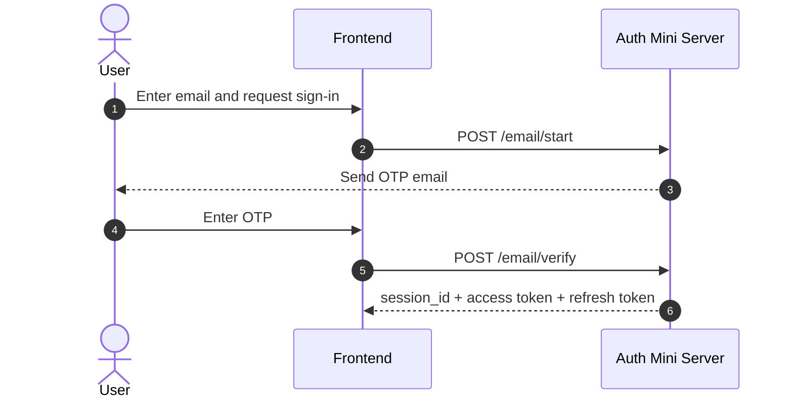
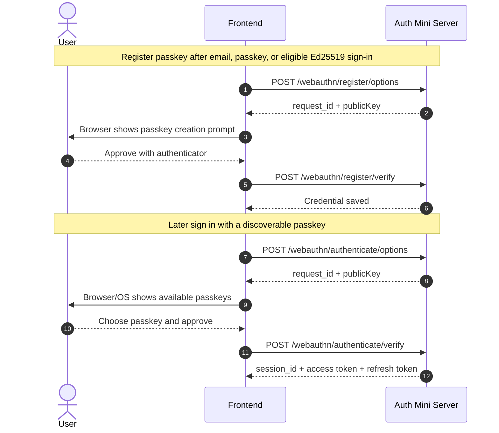
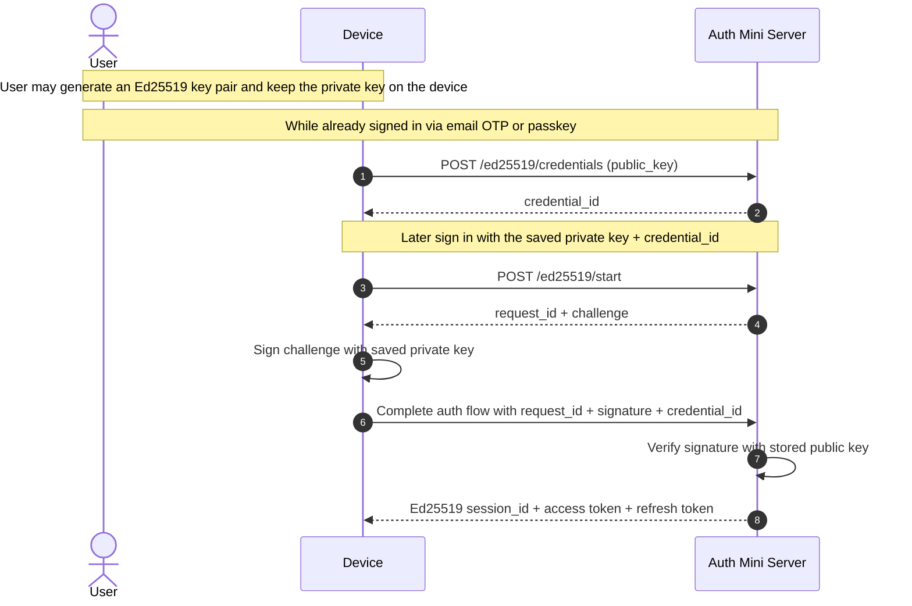
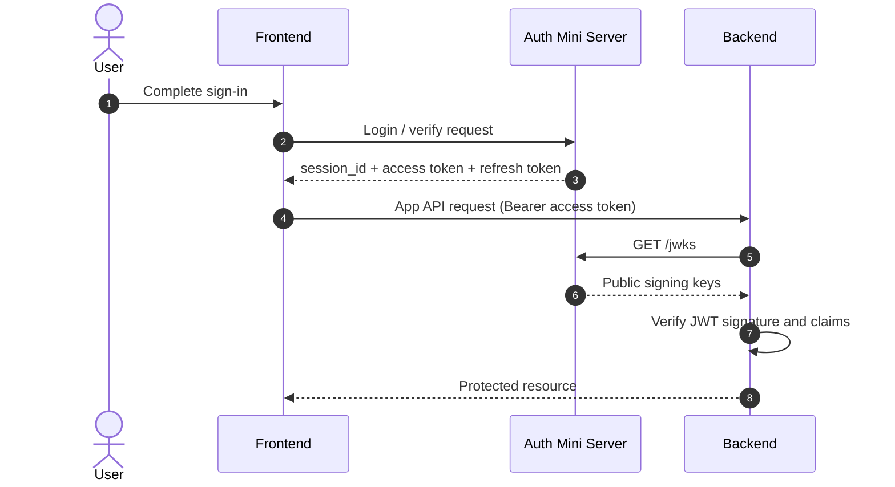

# auth-mini

> **Authentication** is a critical subsystem to prove who users are, while **Authorization** is another critical subsystem to control what users can do.

Minimal, opinionated authentication server for apps that just need a solid authentication core.

[Docs](docs/) | [GitHub](https://github.com/zccz14/auth-mini)

✅ Good fit for authentication system needs:

- 🔒 Password-less Authentication
  - 📧 Email One-Time Password (OTP) sign-in
  - 🔑 Passkey (WebAuthn) sign-in
  - 🔐 Ed25519 (EdDSA) sign-in for non-browser clients without WebAuthn support
- 🔄 Session Management
  - Issue JSON Web Token (JWT) access tokens for backend stateless verification
  - CURRENT/STANDBY JWKS key pairs for smooth key rotation
  - Issue opaque refresh tokens for long-term sessions and easy revocation while keeping JWTs short-lived
- You control the server and data. Not Google. Not AWS. Not Auth0. You.
  - Simple SQLite storage without extra Database servers (no Postgres, MySQL, Redis, etc. required)
  - Wildcard CORS (`Access-Control-Allow-Origin: *`) for cross-origin front-ends.
- UUID-based user ID keeps it simple and opaque, and could be foreign keys for your app's user records if you want.

❌ Not trying to include: (But you can build these on top if you want!)

- Authorization features like ACLs, RBAC, ABAC, roles, permissions, groups, etc.
- Social Login like "Sign in with Google/Facebook/GitHub/etc."
- SMS or TOTP 2FA factors.
- User profiles like names, avatars, bios, etc.
- User management features like admin dashboards, user search etc.

## OIDC positioning

Auth Mini Core is not an OIDC Provider. Its core goal is brand-owned identity across apps under the same brand, while keeping the authentication model simple.

OIDC has ecosystem value, especially for existing applications that only integrate through OIDC. But it also brings significant protocol and concept complexity, so it should not define or pollute Auth Mini Core. Apps built with Auth Mini in mind should use the native HTTP API or SDKs instead of OIDC.

If OIDC compatibility is needed, the intended direction is an optional bridge or adapter layer that translates OIDC flows to Auth Mini Core. Auth Mini Core should not need to understand OIDC or OAuth concepts such as `client_id`, `scope`, `authorization_code`, `id_token`, or `grant_type`.

## Main user journeys

### Email OTP sign-in



The downstream Browser and Device high-level SDKs expose sign-in, session, and refresh lifecycle APIs; they do not provide `sdk.me.fetch()`. `GET /me` remains a self-audience profile and account-management capability for Auth Mini's own server-side GUI. The low-level `auth-mini/sdk/api` client retains `sdk.me.get()` for callers with an appropriate self-audience token.

### Passkey registration and sign-in



### Device sign-in with Ed25519 keys



### Frontend -> backend -> `/jwks` verification



## Quick Start

Pre-requisites:

- Optional SMTP service credentials for email OTP. Admin Ed25519 bootstrap does not require SMTP. Most email providers have SMTP options, or you can use transactional email services like SendGrid, Mailgun, etc.

Install the release binary for Linux or macOS, verify its checksum, and put `auth-mini` on `PATH`:

```bash
curl -LO https://github.com/zccz14/auth-mini/releases/download/latest/auth-mini-linux-x86_64.tar.gz
curl -LO https://github.com/zccz14/auth-mini/releases/download/latest/auth-mini-linux-x86_64.tar.gz.sha256
shasum -a 256 -c auth-mini-linux-x86_64.tar.gz.sha256
tar -xzf auth-mini-linux-x86_64.tar.gz
chmod +x auth-mini
sudo mv auth-mini /usr/local/bin/auth-mini
auth-mini
```

GitHub Release assets provide prebuilt binaries for Linux and macOS. Use the matching archive, verify its checksum, and put `auth-mini` on `PATH`. The npm package no longer provides a CLI; it only ships SDK exports. The released Rust binary is the `auth-mini` server runtime.

Start the server. With no arguments, auth-mini listens on `127.0.0.1:7777` and stores SQLite data at `~/.auth-mini/default.sqlite3`:

```bash
auth-mini
```

For deployment, the CLI only accepts the bind host, bind port, and database path:

```bash
auth-mini --host 127.0.0.1 --port 7777 --db ./auth-mini.sqlite
```

Initialize the administrator Ed25519 credential from the demo setup screen, or call the loopback-only admin setup API from the machine running auth-mini:

```bash
curl -X PUT http://127.0.0.1:7777/admin/setup \
  -H 'content-type: application/json' \
  -d '{"admin_ed25519":{"name":"ops laptop","public_key":"<base58-ed25519-public-key>"}}'
```

After admin sign-in, configure the externally visible issuer, passkey RP ID, and optional SMTP settings from the admin configuration page or `/admin/config`. The issuer is stored at `app_meta.issuer`, and passkey registration/login use the single `app_meta.rp_id`; the WebAuthn origin is the Auth Mini server origin derived from the issuer. SMTP is not required for bootstrap, the SMTP password is never returned, and `admin_ed25519` can create an admin user without an email address for later Ed25519 login. An Ed25519 session may register that user's first PassKey; after one is stored, additional PassKey registration requires an email OTP or WebAuthn session. HTTP CORS is served with `Access-Control-Allow-Origin: *`, so downstream apps need to manage that exposure carefully.

When the Rust binary DB path is omitted, it uses `~/.auth-mini/default.sqlite3`. Server startup creates the SQLite file, parent directory, `app_meta`, JWKS keys, and schema automatically when missing. The Rust binary prints the SQLite database path it uses to stderr. The Rust binary embeds the database schema and `openapi.yaml`; runtime initialization uses the embedded schema. The Rust runtime has no `--openapi` parameter, and `/openapi.yaml` plus `/openapi.json` do not depend on the current working directory.

Then deploy it with your preferred hosting method.

Minimal browser SDK usage:

```ts
import { createBrowserSdk } from 'auth-mini/sdk/browser';

const sdk = createBrowserSdk('https://auth.your-domain.com');

sdk.session.onChange((state) => {
  console.log('auth status:', state.status);
});
```

Minimal device SDK usage:

```ts
import { createDeviceSdk } from 'auth-mini/sdk/device';

const sdk = createDeviceSdk({
  serverBaseUrl: 'https://auth.your-domain.com',
  privateKey: '<base58 64-byte Solana-compatible private key>',
});

await sdk.ready;
```

Minimal backend JWT verification (jose example):

```js
import { createRemoteJWKSet, jwtVerify } from 'jose';

const issuer = 'https://auth.your-domain.com';
const audience = 'app.your-domain.com';
const JWKS = createRemoteJWKSet(new URL(`/jwks`, issuer));

async function verifyAccessToken(token) {
  try {
    const { payload } = await jwtVerify(token, JWKS, {
      issuer,
      audience,
    });
    console.log('Token is valid. Payload:', payload);
  } catch (err) {
    console.error('Invalid token:', err);
  }
}
```

From there, typical integration looks like this:

- start auth-mini with `--host`, `--port`, and `--db` as needed
- initialize the admin Ed25519 credential, then configure issuer, passkey RP ID, and optional SMTP from the admin configuration page or `/admin/config`
- sign in via email OTP and optionally register a passkey
- send the access token to your backend and verify it with `/jwks`

## Docs and next steps

`docs/` is the canonical static reference source. `ui-web/` is the current interactive demo source, and the Rust release binary embeds it under `/web/` so the same server can serve the browser flows end-to-end.

### Integration guides

Choose the guide that matches the part of your app integrating with Auth Mini:

- Browser SDK integration: [docs/integration/browser-sdk.md](docs/integration/browser-sdk.md)
- Device SDK integration: [docs/integration/device-sdk.md](docs/integration/device-sdk.md)
- API SDK integration: [docs/integration/api-sdk.md](docs/integration/api-sdk.md)
- WebAuthn integration: [docs/integration/webauthn.md](docs/integration/webauthn.md)
- Login redirect integration: [docs/integration/login-redirect.md](docs/integration/login-redirect.md)
- Backend JWT verification: [docs/integration/backend-jwt-verification.md](docs/integration/backend-jwt-verification.md)

### Reference

- HTTP API reference: [docs/reference/http-api.md](docs/reference/http-api.md)
- CLI and operations: [docs/reference/cli-and-operations.md](docs/reference/cli-and-operations.md)

The integration guides describe app-facing flows and SDK usage; the reference pages document the HTTP contract and server operations.

## Philosophy

### Why not a full auth platform?

If your project only needs authentication, a larger backend platform can be unnecessary overhead. auth-mini focuses on the auth slice so you can keep users, sessions, SMTP config, and signing keys understandable.

### Why email OTP + passkeys?

Email is familiar and useful for recovery and communication. Passkeys then provide phishing-resistant, username-less sign-in with discoverable credentials instead of another password system.

### Why SQLite?

Auth data is usually small, and operational simplicity matters. SQLite is easy to run, back up, inspect, and move without introducing another server just because auth sounds important.

### Why access + refresh tokens?

Access tokens stay short-lived and verifiable by APIs through `/jwks`; refresh tokens stay revocable and database-backed. That keeps backend verification simple without pretending leaked JWTs are easy to revoke.

## Development

Run `npm run format`, `npm run lint`, `npm run typecheck`, and `npm test`.

## Release version rule

Release versioning is intentionally independent across artifacts. The npm SDK is
published from `package.json`; Rust server binaries are continuously published
from `main` under the moving `latest` GitHub Release tag; and
`auth-mini-axum` has its own immutable crates.io SemVer in
`crates/auth-mini-axum/Cargo.toml`. Do not couple a crate version to the npm
package version or to the server binary's internal manifest version.

## License

MIT License
